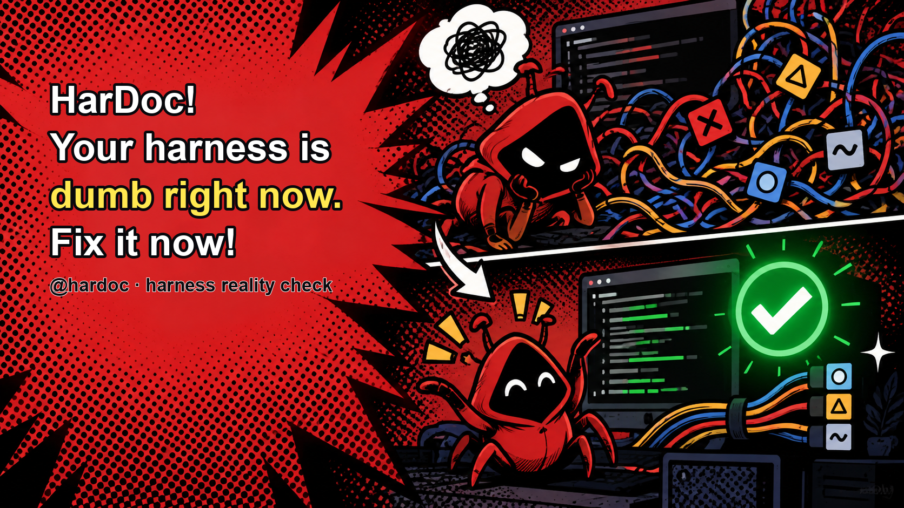

# HarDoc



> HarDoc! Your harness is dumb right now. Fix it now!

HarDoc verifica o harness do Claude Code e do Codex em modo somente leitura. Ele encontra instruções duplicadas ou conflitantes que podem fazer o assistente escolher o skill errado.

[English](README.md) · [한국어](README.ko.md) · [All language pages](README.md#read-hardoc-in-your-language)

## Instalar para Claude Code

Execute estes dois comandos uma vez:

```bash
claude plugin marketplace add https://github.com/qjc-office/hardoc
claude plugin install hardoc@hardoc-marketplace
```

## Instalar localmente no Codex

Para instalar a skill diretamente no Codex, clone o repositório e crie um link na sua pasta local de skills:

```bash
git clone https://github.com/qjc-office/hardoc.git
cd hardoc
CODEX_SKILLS_DIR="${CODEX_HOME:-$HOME/.codex}/skills"
mkdir -p "$CODEX_SKILLS_DIR"
ln -sfn "$PWD/plugin/skills/skill-governor" "$CODEX_SKILLS_DIR/skill-governor"
```

## Usar no Claude Code

Abra uma nova sessão do Claude Code e execute:

```text
/skill-governor audit .
```

## Usar com Codex

Se o skill aparecer no Codex, abra uma nova sessão e execute:

```text
$skill-governor audit .
```

## O que o HarDoc verifica

O HarDoc verifica primeiro o diretório do projeto, depois a versão da CLI e tenta executar o doctor nativo de cada runtime.

- `claude doctor`: Verifica a saúde da instalação do Claude Code.
- `codex doctor`: Verifica a saúde da instalação do Codex.
- `audit`: Verifica skills, MCP, plugins, rules, hooks, agents e evidências de uso real.

## Limites de segurança

O HarDoc é somente leitura. Ele não exclui, desativa, instala nem altera a configuração do harness e não corrige resultados do doctor automaticamente. Revise as propostas antes de qualquer mudança.

Veja o [README em inglês](README.md) para o guia completo e a avaliação.
